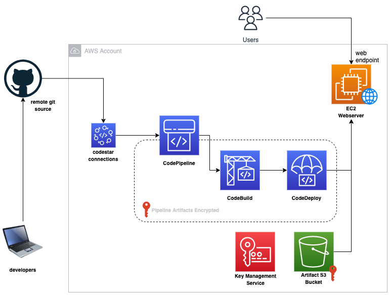

# EC2 Webserver powered by CICD pipeline


### Resources provisioned
- Codepipeline
- CodeBuild
- CodeDeploy
- Codestar Connections
- EC2 attached with an Elastic IP and Security Group
- KMS key
- IAM roles, policies and profiles

## Prerequisites
- Configure awscli to your account
- Create an AWS S3 bucket to store backend state (in the use1 region)
- Terraform version 1.0
- GitHub Account hosting web code

## Initialize Infrastructure Code
Navigate to `backend.tf` and `variables.tf` file and customize your values
```bash
### backend.tf 
terraform {
  backend "s3" {
    bucket = "${TF_S3_BACKEND_BUCKET_NAME}"
    key    = "webserver"
    region = "us-east-1"
  }
}

### variable.tf
...
variable "stack_name" {
  default = "challenge" # <-- update
}
```

To validate prerequisites, run
```bash
make init
```

## Provision Infrastructure
To customize your installation, update the `variables.tf` with your custom values
To provision infrastructure, run
```bash
make build HTTP_CIDR=<Insert private cidr here>
```

When all resources are provisioned, you will have to connect `codestar-connections` to your GitHub account. 
- Go to the codestar connections dashboard here - https://console.aws.amazon.com/codesuite/settings/connections?region=us-east-1
- Follow the instructions in this [document](https://docs.aws.amazon.com/codepipeline/latest/userguide/connections-github.html#connections-github-console) to link codestar to your GitHub account

## Security Features Included?
- SSH port is not open on the webserver security group. To gain ssh access to the server, Connect using SSM's Session Manager
- Pipeline and artifacts are encrypted with AWS KMS Customer Managed Key

## Smoke Test
To run smoke test to confirm app is deployed, run
```bash
make test
# If you want to test a particular version, then
SHORT_HASH_OR_TAG=v1.0.0 make test
```
replace `v1.0` with git tag or short hash of released version

## Clean Up
To clean up resources
```bash
make clean HTTP_CIDR=<Insert private cidr here>
```

## Improvements
- Make webserver architecture highly available
- For reusability, make network diagram as module
- Secure website with SSL certificate terminated on the Load Balancer
- Reduce scope of IAM roles further
- Enable [github advanced security](https://docs.github.com/en/code-security/secret-scanning/configuring-secret-scanning-for-your-repositories) to scan repository for secrets and vulnerabilities
- Trigger a separate pipeline based on tagging to different environment (like production)
- Add security stage to the pipeline to run test on code and on web endpoint